Regorus uses the following grammar that has been derived from the official [OPA grammar](https://www.openpolicyagent.org/docs/latest/policy-reference/#grammar) as well as observed OPA behavior. 

```ebnf

module           ::= package  imports rule*
package          ::= 'package' path-ref
imports          ::= ( 'import' path-ref ( 'as' var )? )*
path-ref         ::= path-ref NO_WS '.' NO_WS IDENT
                 | path-ref NO_WS '[' STRING ']'
                 | IDENT
rule             ::= default-rule
                 | spec-rule
default-rule     ::= 'default' rule-ref assign-op term
spec-rule        ::= rule-head rule-bodies
rule-head        ::= func-rule
                 | contains-rule
                 | object-rule
                 | set-rule
                 | compr-rule
func-rule        ::= rule-ref '(' term ( ',' term )* ','? ')' rule-assign?
contains-rule    ::=  rule-ref 'contains' or-expr
object-rule      ::= rule-ref NO_WS '[' membership-expr ']' rule-assign
set-rule         ::= rule-ref NO_WS '[' membership-expr ']'
compr-rule       ::= rule-ref rule-assign?
rule-ref         ::= rule-ref NO_WS  '.' NO_WS var
                 | path-ref NO_WS '[' membership-expr ']'
                 | var
rule-assign      ::= assign-op membership-expr
rule-bodies      ::=  'if'  '{' query '}' alternatives
                 | 'if' literal-stmt alternatives
                 | '{' query '}' alternatives
alternatives     ::= query-blocks
                 | else-blocks
query-blocks     ::= ( '{' query '}' )*
else-blocks      ::= ( else-block )*
else-block       ::= 'else' rule-assign? 'if' '{' query '}'
                 | 'else' rule-assign? 'if' literal-stmt
                 | 'else' rule-assign? '{' query '}'
assign-op        ::= '=' | ':='
query            ::= literal-stmt ( sep  literal-stmt )*
sep              ::= ';' | '\n' | '\r\n'
literal-stmt     ::= literal with-modifiers
with-modifiers   ::= ( 'with' path-ref 'as' in-expr )*
literal          ::= some
                 | every
                 | expr
                 | not-expr
some             ::= some-vars
                 | some-in
some-vars        ::= 'some' var ( ',' var )*
some-in          ::= 'some' ref ( ',' ref )? 'in'
every            ::= 'every' var ( ',' var )? 'in' bool-expr '{' query '}'
expr             ::= assign-expr
not-expr         ::= 'not' assign-expr
assign-expr      ::= ref assign-op membership-expr
membership-expr  ::=  membership-expr 'in' bool-expr
                 | bool-expr ',' bool-expr
                 | bool-expr
in-expr          ::= in-expr 'in' bool-expr
                 | bool-expr
bool-expr        ::= bool-expr bool-op or-expr
                 | or-expr
bool-op          ::= '<' | '<=' | '==' | '>=' | '>' | '!='
set-union-expr   ::= set-union-expr '|' set-intersection-expr
                 | set-intersection-expr
set-intersection-expr ::= set-intersection-expr '&' arith-expr
                 | arith-expr
arith-expr       ::= arith-expr ('+' | '-') mul-div-expr
                 | mul-div-expr
mul-div-expr     ::= mul-div-expr ('*' | '/') term
                 | term
term             ::= ref
ref              ::= scalar-or-var
                 | compr-set-or-object
                 | compr-or-array
                 | unary-expr
                 | parens-expr
                 | ref-dot
                 | ref-brack
                 | call-expr
ref-dot          ::= ref NO_WS '.' NO_WS var
ref-brack        ::= ref NO_WS '[' in-expr ']'
call-expr        ::= path-ref NO_WS '(' call-args  ','? ')'
call-args        ::= in-expr ( ',' in-expr )*
parens-expr      ::= '(' membership-expr ')'
unary-expr       ::= '-' in-expr
compr-set-or-object ::= set-compr
                    | set
                    | object-compr
                    | object
set-compr        ::= '{' compr '}'
set              ::= '{' in-expr  ( ',' in-expr )* ','? '}'
                 | 'set(' ')'
object           ::= '{' field ( ',' field )* ','? '}'
                 | '{' '}'
field            ::= in-expr ':' in-expr
compr-or-array   ::= array-compr
                 | array
array-compr      ::= '[' compr ']'
array            ::= '[' in-expr ( ',' in-expr )* ','? ']'
                 | '[' ']'  
compr            ::= ref '|' query
scalar-or-var    ::= var
                 | NUMBER
                 | STRING
                 | RAWSTRING
                 | 'null'
                 | 'true'
                 | 'false'
var              ::= IDENT
                 | non-imported-future-keyword
non-imported-future-future-keyword ::= 'contains' | 'every' | 'if' | 'in'

```

Below is the RailRoad Diagram for the grammar.

**module:**

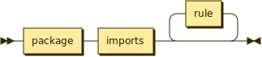

```
module   ::= package imports rule*
```

**package:**

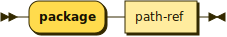

```
package  ::= 'package' path-ref
```

referenced by:

* module

**imports:**

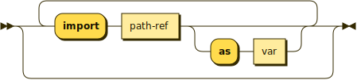

```
imports  ::= ( 'import' path-ref ( 'as' var )? )*
```

referenced by:

* module

**path-ref:**


```
path-ref ::= IDENT ( NO_WS ( '.' NO_WS IDENT | '[' STRING ']' ) )*
```

referenced by:

* call-expr
* imports
* package
* rule-ref
* with-modifiers

**rule:**

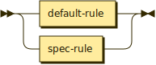

```
rule     ::= default-rule
           | spec-rule
```

referenced by:

* module

**default-rule:**

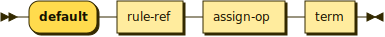

```
default-rule
         ::= 'default' rule-ref assign-op term
```

referenced by:

* rule

**spec-rule:**

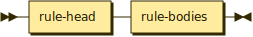

```
spec-rule
         ::= rule-head rule-bodies
```

referenced by:

* rule

**rule-head:**

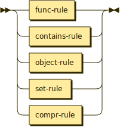

```
rule-head
         ::= func-rule
           | contains-rule
           | object-rule
           | set-rule
           | compr-rule
```

referenced by:

* spec-rule

**func-rule:**

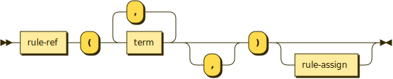

```
func-rule
         ::= rule-ref '(' term ( ',' term )* ','? ')' rule-assign?
```

referenced by:

* rule-head

**contains-rule:**

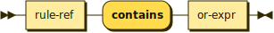

```
contains-rule
         ::= rule-ref 'contains' or-expr
```

referenced by:

* rule-head

**object-rule:**

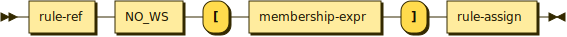

```
object-rule
         ::= rule-ref NO_WS '[' membership-expr ']' rule-assign
```

referenced by:

* rule-head

**set-rule:**

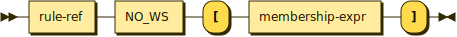

```
set-rule ::= rule-ref NO_WS '[' membership-expr ']'
```

referenced by:

* rule-head

**compr-rule:**

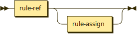

```
compr-rule
         ::= rule-ref rule-assign?
```

referenced by:

* rule-head

**rule-ref:**

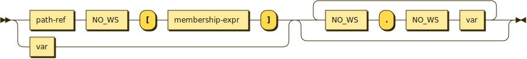

```
rule-ref ::= ( path-ref NO_WS '[' membership-expr ']' | var ) ( NO_WS '.' NO_WS var )*
```

referenced by:

* compr-rule
* contains-rule
* default-rule
* func-rule
* object-rule
* set-rule

**rule-assign:**

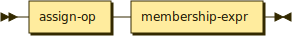

```
rule-assign
         ::= assign-op membership-expr
```

referenced by:

* compr-rule
* else-block
* func-rule
* object-rule

**rule-bodies:**

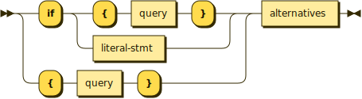

```
rule-bodies
         ::= ( 'if' ( '{' query '}' | literal-stmt ) | '{' query '}' ) alternatives
```

referenced by:

* spec-rule

**alternatives:**

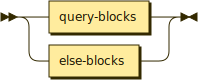

```
alternatives
         ::= query-blocks
           | else-blocks
```

referenced by:

* rule-bodies

**query-blocks:**


```
query-blocks
         ::= ( '{' query '}' )*
```

referenced by:

* alternatives

**else-blocks:**

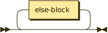

```
else-blocks
         ::= else-block*
```

referenced by:

* alternatives

**else-block:**

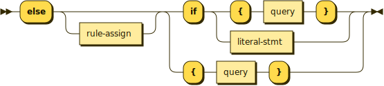

```
else-block
         ::= 'else' rule-assign? ( 'if' ( '{' query '}' | literal-stmt ) | '{' query '}' )
```

referenced by:

* else-blocks

**assign-op:**

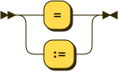

```
assign-op
         ::= '='
           | ':='
```

referenced by:

* assign-expr
* default-rule
* rule-assign

**query:**

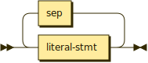

```
query    ::= literal-stmt ( sep literal-stmt )*
```

referenced by:

* compr
* else-block
* every
* query-blocks
* rule-bodies

**sep:**

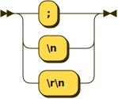

```
sep      ::= ';'
           | '\n'
           | '\r\n'
```

referenced by:

* query

**literal-stmt:**

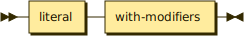

```
literal-stmt
         ::= literal with-modifiers
```

referenced by:

* else-block
* query
* rule-bodies

**with-modifiers:**

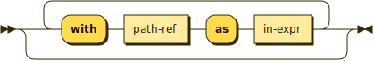

```
with-modifiers
         ::= ( 'with' path-ref 'as' in-expr )*
```

referenced by:

* literal-stmt

**literal:**

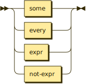

```
literal  ::= some
           | every
           | expr
           | not-expr
```

referenced by:

* literal-stmt

**some:**

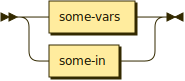

```
some     ::= some-vars
           | some-in
```

referenced by:

* literal

**some-vars:**

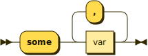

```
some-vars
         ::= 'some' var ( ',' var )*
```

referenced by:

* some

**some-in:**

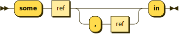

```
some-in  ::= 'some' ref ( ',' ref )? 'in'
```

referenced by:

* some

**every:**

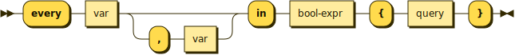

```
every    ::= 'every' var ( ',' var )? 'in' bool-expr '{' query '}'
```

referenced by:

* literal

**expr:**

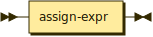

```
expr     ::= assign-expr
```

referenced by:

* literal

**not-expr:**

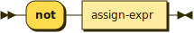

```
not-expr ::= 'not' assign-expr
```

referenced by:

* literal

**assign-expr:**

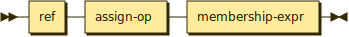

```
assign-expr
         ::= ref assign-op membership-expr
```

referenced by:

* expr
* not-expr

**membership-expr:**

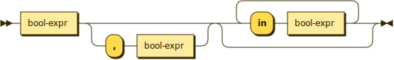

```
membership-expr
         ::= bool-expr ( ',' bool-expr )? ( 'in' bool-expr )*
```

referenced by:

* assign-expr
* object-rule
* parens-expr
* rule-assign
* rule-ref
* set-rule

**in-expr:**

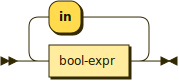

```
in-expr  ::= bool-expr ( 'in' bool-expr )*
```

referenced by:

* array
* call-args
* field
* ref-brack
* set
* unary-expr
* with-modifiers

**bool-expr:**

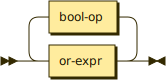

```
bool-expr
         ::= or-expr ( bool-op or-expr )*
```

referenced by:

* every
* in-expr
* membership-expr

**bool-op:**

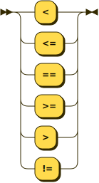

```
bool-op  ::= '<'
           | '<='
           | '=='
           | '>='
           | '>'
           | '!='
```

referenced by:

* bool-expr

**or-expr:**

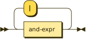

```
or-expr  ::= and-expr ( '|' and-expr )*
```

referenced by:

* bool-expr
* contains-rule

**and-expr:**

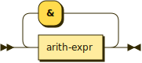

```
and-expr ::= arith-expr ( '&' arith-expr )*
```

referenced by:

* or-expr

**arith-expr:**

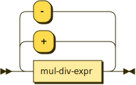

```
arith-expr
         ::= mul-div-expr ( ( '+' | '-' ) mul-div-expr )*
```

referenced by:

* and-expr

**mul-div-expr:**

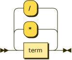

```
mul-div-expr
         ::= term ( ( '*' | '/' ) term )*
```

referenced by:

* arith-expr

**term:**

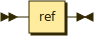

```
term     ::= ref
```

referenced by:

* default-rule
* func-rule
* mul-div-expr

**ref:**

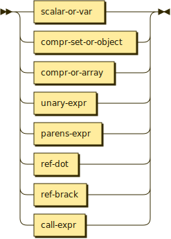

```
ref      ::= scalar-or-var
           | compr-set-or-object
           | compr-or-array
           | unary-expr
           | parens-expr
           | ref-dot
           | ref-brack
           | call-expr
```

referenced by:

* assign-expr
* compr
* ref-brack
* ref-dot
* some-in
* term

**ref-dot:**


```
ref-dot  ::= ref NO_WS '.' NO_WS var
```

referenced by:

* ref

**ref-brack:**

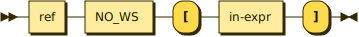

```
ref-brack
         ::= ref NO_WS '[' in-expr ']'
```

referenced by:

* ref

**call-expr:**

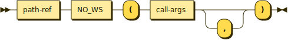

```
call-expr
         ::= path-ref NO_WS '(' call-args ','? ')'
```

referenced by:

* ref

**call-args:**

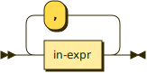

```
call-args
         ::= in-expr ( ',' in-expr )*
```

referenced by:

* call-expr

**parens-expr:**

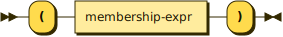

```
parens-expr
         ::= '(' membership-expr ')'
```

referenced by:

* ref

**unary-expr:**

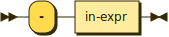

```
unary-expr
         ::= '-' in-expr
```

referenced by:

* ref

**compr-set-or-object:**

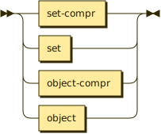

```
compr-set-or-object
         ::= set-compr
           | set
           | object-compr
           | object
```

referenced by:

* ref

**set-compr:**

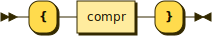

```
set-compr
         ::= '{' compr '}'
```

referenced by:

* compr-set-or-object

**set:**

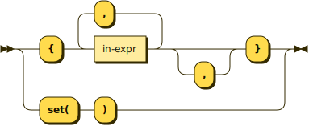

```
set      ::= '{' in-expr ( ',' in-expr )* ','? '}'
           | 'set(' ')'
```

referenced by:

* compr-set-or-object

**object:**

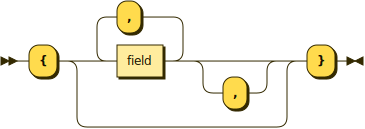

```
object   ::= '{' ( field ( ',' field )* ','? )? '}'
```

referenced by:

* compr-set-or-object

**field:**


```
field    ::= in-expr ':' in-expr
```

referenced by:

* object

**compr-or-array:**


```
compr-or-array
         ::= array-compr
           | array
```

referenced by:

* ref

**array-compr:**


```
array-compr
         ::= '[' compr ']'
```

referenced by:

* compr-or-array

**array:**


```
array    ::= '[' ( in-expr ( ',' in-expr )* ','? )? ']'
```

referenced by:

* compr-or-array

**compr:**


```
compr    ::= ref '|' query
```

referenced by:

* array-compr
* set-compr

**scalar-or-var:**


```
scalar-or-var
         ::= var
           | NUMBER
           | STRING
           | RAWSTRING
           | 'null'
           | 'true'
           | 'false'
```

referenced by:

* ref

**var:**


```
var      ::= IDENT
           | non-imported-future-keyword
```

referenced by:

* every
* imports
* ref-dot
* rule-ref
* scalar-or-var
* some-vars

**non-imported-future-future-keyword:**


```
non-imported-future-future-keyword
         ::= 'contains'
           | 'every'
           | 'if'
           | 'in'
```

## 
 <sup>generated by [RR - Railroad Diagram Generator][RR]</sup>

[RR]: https://www.bottlecaps.de/rr/ui
